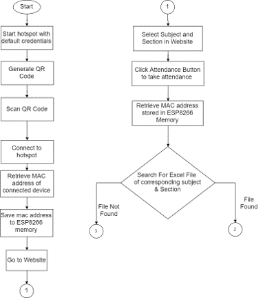
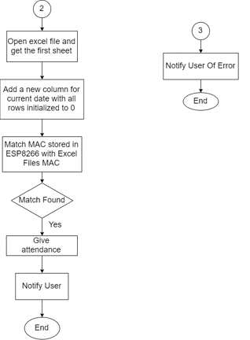

# Student-Attendance-Using-ESP8266

This is a prototype of an automated student attendance system wherein you connect to the local hotspot of your class and your attendance is recorded automatically.

- [Report](./Docs/Report.pdf)
- [Presentation](./Docs/Presentation.pptx)
- [Video](https://youtu.be/APaUofxBEpw)

## Dependencies
### Device
- [ESP8266 Libraries](http://arduino.esp8266.com/stable/package_esp8266com_index.json)
- [WiFiManager](https://github.com/tzapu/WiFiManager)

### Server/Client
- [PhpSpreadsheet](https://phpspreadsheet.readthedocs.io/en/latest/)
- Latest jquery
- Bootstrap 4
- [jQuery.storage.js](https://github.com/yckart/jquery.storage.js)
- [QRCode.js](https://github.com/ricmoo/QRCode)

## References
- [MAC Address Retrieval](https://github.com/esp8266/Arduino/issues/2100)
- [SPIFFS File Handling](https://shepherdingelectrons.blogspot.com/2019/04/esp8266-as-spiffs-http-server.html)
- [PhpSpreadsheet Setup & Tutorial](https://youtu.be/4ULDJ5LfdwU)

## Project Members
- Saqibur Rahman
- Ahmed Ali Fahim
- Sahil Aziz
- Nazmul Hasan Tanmoy
- Sachi Datta
- Tasnim Ahmed
- Mirza Nowshin Nazim
- Priya Roy